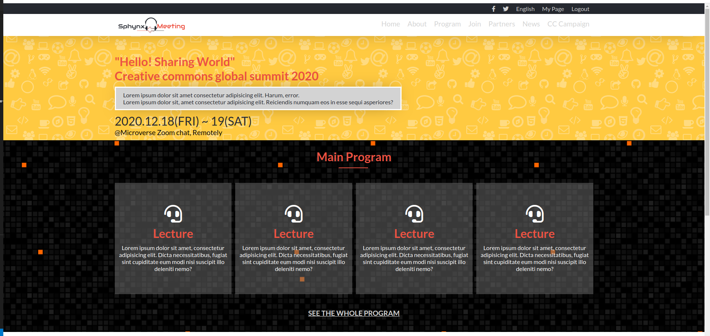
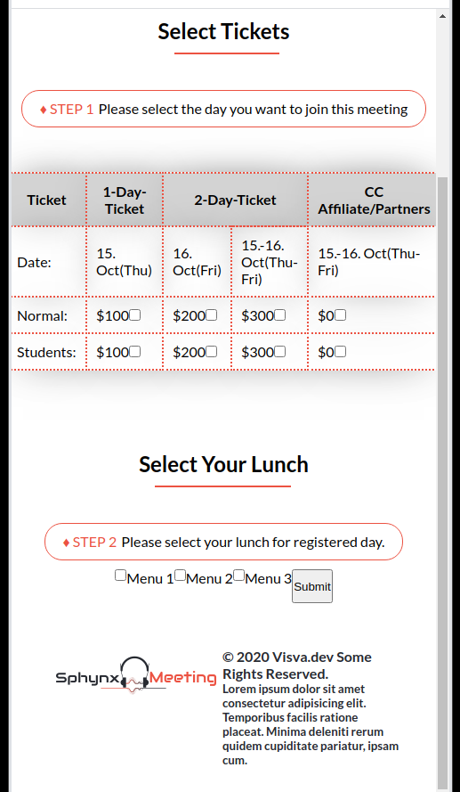

# Conference-page
Microverse HTML &amp; CSS capstone project: Conference page
In this project, i'm using Html, CSS & little bit of Javascript to build capstone project.
Project is based on an online website for a conference, but i created website for our team meeting after we finish Microverse.
As much as i can i followed the best practices that i already learned in the previous projects, like setting-up a code linter, using Github flow, making good commit messages and writing a good README.
Website consists of 3 pages - main page, about page and tickets page, Each of these pages has been designed to be responsive for all device sizes.

## Built With

- Html
- CSS
- Javascript

## Live Demo

[Live Demo Link](https://rawcdn.githack.com/visva-dev/Conference-page/e95d0aba715cdf315da8f3f6eef8fe7a21f07f36/index.html)

## Demo video

[Live demo video link](https://www.loom.com/share/093397079da942b28922d9390bee1c88)

## Acknowledgements

Special thanks to Mathew Cindy Shin for the design idea.
(https://www.behance.net/adagio07)

## Authors

👤 **Visvaldas Rapalis**

- Github: [@visva-dev](https://github.com/visva-dev)
- Twitter: [@Visva_Dev](https://twitter.com/Visva_Dev)
- Linkedin: [@Visvaldas-Rapalis](https://www.linkedin.com/in/visvaldas-rapalis/)

## 🤝 Contributing

Contributions, issues and feature requests are welcome! Start by:

- Forking the project
- Cloning the project to your local machine
- `cd` into the Youtube-Replica project directory
- Run `git checkout -b your-branch-name`
- Make your contributions
- Push your branch up to your forked repository
- Open a Pull Request with a detailed description to the development branch of the original project for a review

## 📝 License

This project is [MIT](https://opensource.org/licenses/MIT) licensed.
